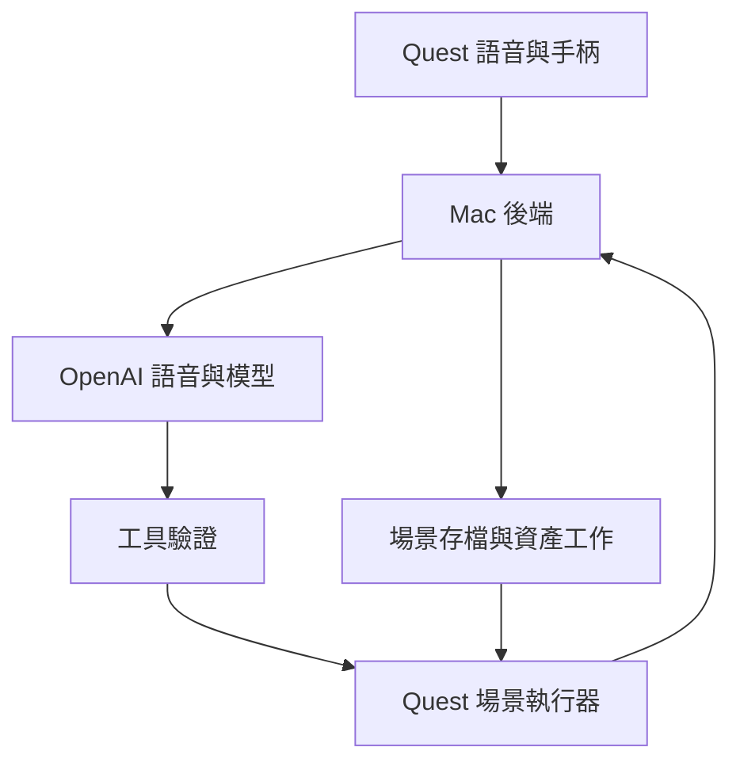

# 自製 Unity App 備案

這是待實作設計，非現有功能。Figmin 的核心驗收失敗或自訂能力不足，再啟動本路線。

## 架構決策

- Quest：Unity 6 相容穩定版、URP、Unity OpenXR、Meta XR Core／Interaction SDK；原生 Android APK。
- Mac：本機後端負責 AI 存取、工具驗證、場景存檔、資產任務與紀錄。
- v0.1：按住說話，錄音 → STT → LLM function calling → 執行 → TTS；比全雙工易除錯。
- v0.2：評估 Realtime 音訊與工具呼叫；原生 Unity 傳輸／音訊須實作驗證，不能直接視為瀏覽器 WebRTC 範例可用。
- Mac 是開發與 bridge 主機；模型可在雲端。Quest 自己渲染畫面，不依賴 Mac PCVR 串流。
- 預設單人、單場景；跨 App 控制與多人同步不在 MVP。



## 操作規格（自製版）

| 輸入 | 動作 |
|---|---|
| 手柄射線 + Trigger | 選取物件，顯示名稱及外框 |
| Grip | 抓取移動；放開後回報變換 |
| A 按住／放開 | 按住錄音，放開送出；可重設按鍵 |
| B | 取消待執行操作／停止語音 |
| 左手 UI | Undo、保存、載入與連線狀態 |
| 語音「這個」 | 使用發話時鎖定的 selectedObjectId |

以上是我們的設計，不是 Figmin 預設按鍵。避免攔截系統保留按鍵。

## 場景模型與座標

統一 Unity：公尺、+Y 向上、+Z 向前；orientation 用 quaternion。GLB 匯入經 importer 處理座標轉換，不手動混用左右手座標。

每個物件至少保存：
`id, name, kind, assetId, positionM, rotationQuaternion, scale, color, physics, version`。

scene 保存 `schemaVersion, sceneId, revision, objects, anchorMetadata`。
「前方一公尺」依發話時頭部水平朝向計算；「桌上」需已識別表面，沒有表面資料時要求點選位置，不能猜測真實桌面。純虛擬模式以地板／指定平面為基準。

重新定位與 recenter 須處理；相對場景座標還原不代表物件仍精確對齊真實桌子。實體對齊另做 Spatial Anchors 階段。

## 最小工具集合

| 工具 | 必要參數／用途 |
|---|---|
| list_objects | sceneId；取得當前權威狀態 |
| create_primitive | shape、name、positionM、sizeM、color |
| update_object | objectId、expectedVersion、patch |
| delete_object | objectId、expectedVersion |
| undo | 最近一個可逆交易 |
| save_scene / load_scene | slotId；載入覆蓋前提供確認 |
| spawn_asset（v0.2） | 核准的 assetId，不接受任意外部 URL |
| generate_asset（v0.3） | prompt、預算上限，回傳非同步 jobId |

初始白名單 cube / sphere / cylinder；工具參數用 JSON Schema 驗證。不得讓模型回傳任意 C#、shell 或 eval 程式碼直接在正式 App 執行。

工具 envelope（擬定格式，非 OpenAI API 原始格式）：

```json
{
  "schemaVersion": 1,
  "requestId": "req-001",
  "sessionId": "session-001",
  "sceneId": "scene-001",
  "expectedSceneRevision": 12,
  "tool": "create_primitive",
  "arguments": {
    "shape": "cube",
    "name": "紅色方塊",
    "positionM": [0, 1.2, 1],
    "sizeM": [0.2, 0.2, 0.2],
    "color": "#FF0000"
  }
}
```

執行器回傳 success／error、objectId、sceneRevision、實際位置尺寸。收到 ACK 才對使用者說成功。
requestId 去重；expectedVersion 不符時重新讀取。斷線重送不能產生第二個方塊。多步指令使用交易紀錄與 undo；部分失敗明確回報。

## API 與網路邊界

- 金鑰只存 Mac 後端的秘密設定；APK／Git 不保存長效金鑰。
- Quest 與後端先配對；請求包含 session token，驗證來源與操作白名單。
- 正式傳輸使用 TLS；測試若用 LAN 開發模式，限制到可信網段且不可直接曝露網際網路。
- 聲音只在使用者啟用錄音時上傳；UI 明示錄音與雲端處理，預設不保存原始錄音。
- 設定可配置的每次會話預算／逾時／物件上限。生成 3D 資產需先顯示預估費用再送工作。
- 本機抓取與物理迴圈不經 AI 網路，AI 操作也要經相同場景命令驗證。

## 生成資產的三階段

1. primitives：立即建立可碰撞、可抓取的幾何形。
2. curated prefabs / GLB：桌子、機器人、電池櫃，包含合適碰撞器与單位。
3. text-to-3D provider：非同步生成、顯示 placeholder、可取消、檢查授權、檔案大小、面數、材質、LOD，再替換成真模型。

不能保證全新精細 3D 模型像方塊般即時完成；先建立 placeholder 保持對話連續。模型資產不得以圖片貼面冒充可操作 3D 網格。

## 逐步開發

1. 安裝 Unity Hub 和與 Meta SDK 相容的 Unity 版本、Android Build Support、SDK/NDK、OpenJDK。
2. 建立 URP 專案，設定 Android／Meta Quest 平台、OpenXR、Meta XR SDK；執行 Project Setup Tool。
3. 鎖定 ProjectVersion.txt、manifest.json、packages-lock.json，留下版本紀錄。
4. 開啟 Quest 開發者模式，USB 授權；確認 `adb devices`；先 Build and Run 空場景。
5. 實作射線選取、Grab、UI；不接 AI，先由測試按鈕 create／update／undo。
6. 建立後端 health／配對／工具路由；先使用 deterministic mock 驗證狀態。
7. 加錄音權限與 PTT，串 STT、工具呼叫與 TTS，先驗證 10 條中文指令。
8. 加保存／載入、斷線處理、重送去重與取消；測 stale selection。
9. 以實機量 frame time、回覆延遲、記憶體與 20 分鐘連續使用。
10. 過關後才加 Realtime、GLB 與 text-to-3D；最後再做 MR surfaces／anchors。

## 預定程式結構（尚未建立）

```text
apps/quest-unity/
  Assets/ChatGPTinQuest/{Input,Scene,Audio,Networking,UI}/
  Packages/
  ProjectSettings/
services/agent-bridge/
  src/{audio,ai,tools,scenes,assets}/
packages/scene-protocol/
tests/{protocol,integration}/
docs/
prompts/
```

## 一手技術文件

- Unity／Quest 設定：https://developers.meta.com/horizon/documentation/unity/unity-project-setup/
- Interaction SDK：https://developers.meta.com/horizon/documentation/unity/unity-isdk-setup/
- Realtime tools：https://developers.openai.com/api/docs/guides/realtime-mcp
- Realtime WebRTC：https://developers.openai.com/api/docs/guides/voice-webrtc
- Meta 官方參考 app：https://github.com/oculus-samples/Unity-SpatialLingo

在真正實作時重新查相容版本、API schema 與可用模型，現在不鎖死未在裝置測試的組合。
